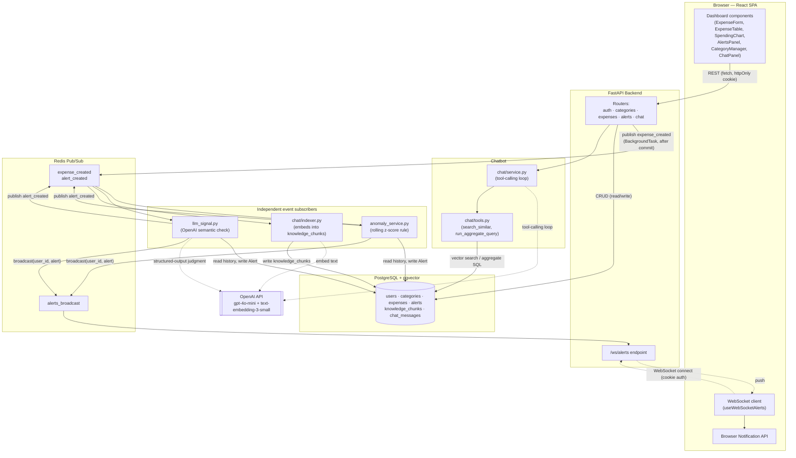
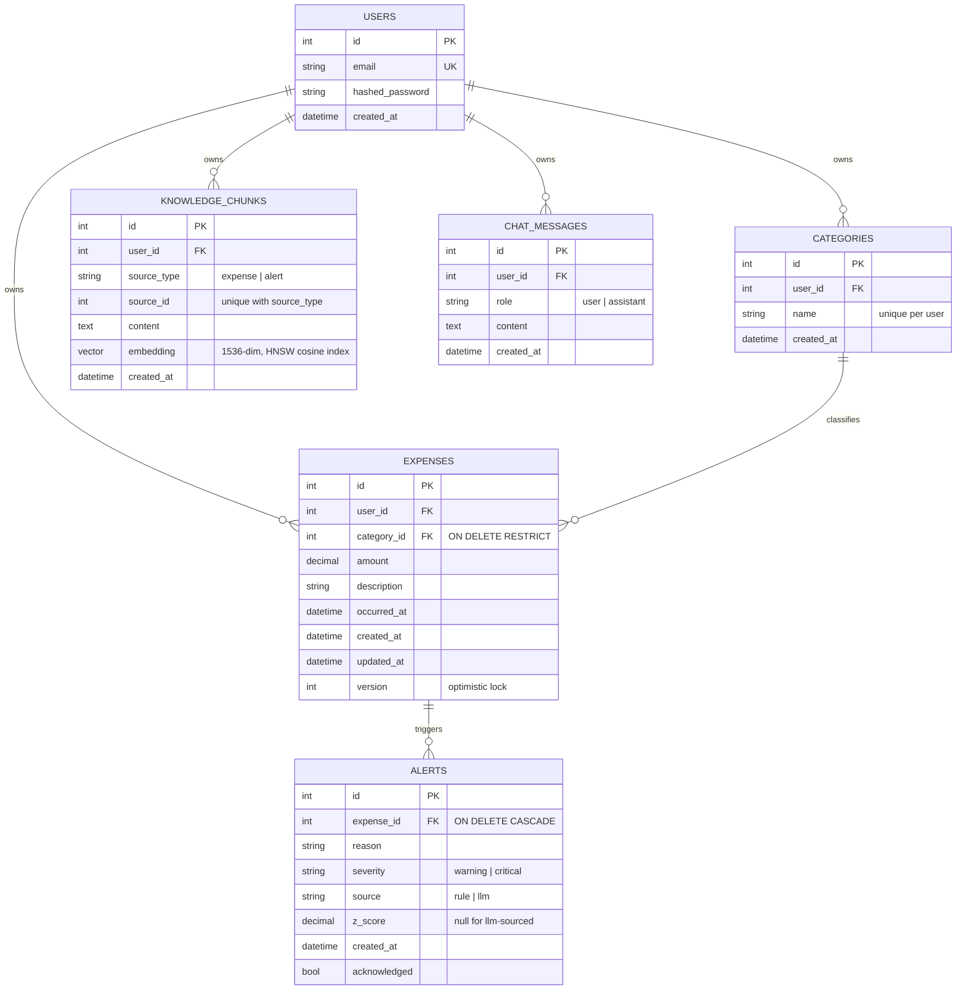
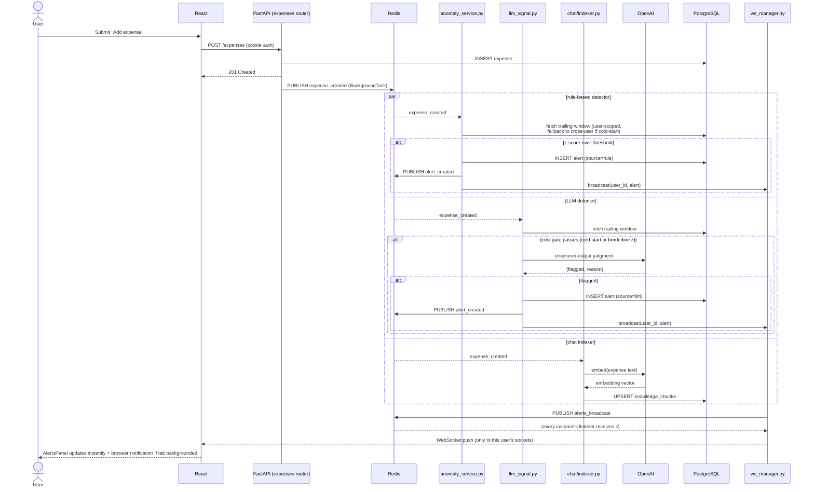
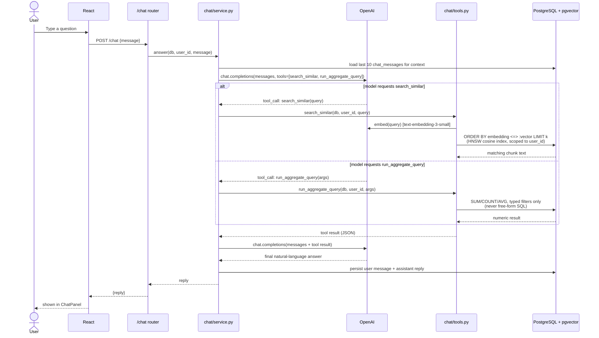
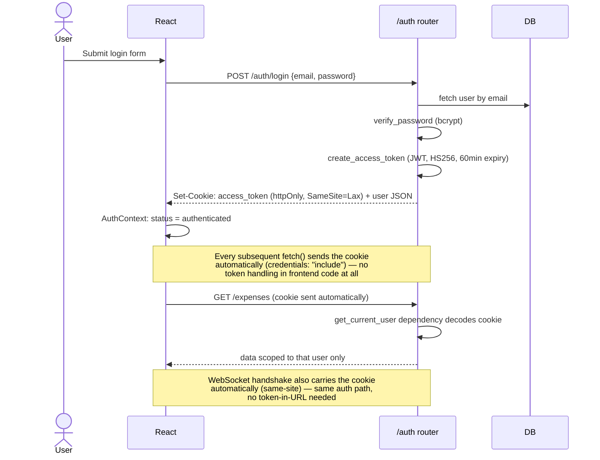
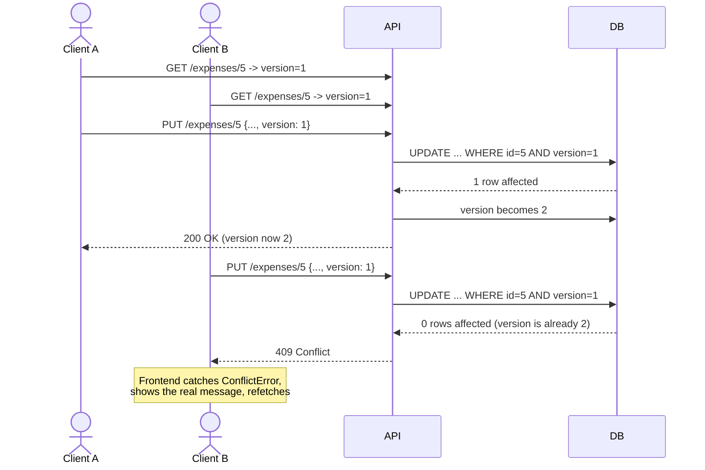

# Architecture Reference

Full technical picture of the system: how the pieces fit together, the data
model, the request/event flows, and what each file is responsible for. This
is the "read this to understand the whole system" doc — for *why* each
decision was made, see [DESIGN.md](DESIGN.md) (v1.0) and
[V2_DESIGN.md](V2_DESIGN.md) (auth, categories, Redis, LLM signal, chatbot).

## 1. System architecture

**Key architectural properties:**
- **CRUD is dumb on purpose.** The `expenses` router only validates, inserts,
  and publishes an event — it has zero knowledge that anomaly detection, a
  chatbot, or anything else exists downstream.
- **Three independent subscribers** react to the same `expense_created`
  event without knowing about each other: the rule-based detector, the LLM
  detector, and the chat indexer. Any one of them could be deleted or moved
  to its own process without touching the other two or the router.
- **Two different Redis usage patterns, deliberately**: `expense_created`/
  `alert_created` are consumed by whichever subscribers are registered in
  *this* process (fine for one backend instance; would need Streams +
  consumer groups to fan work across multiple instances without duplicate
  processing — see V2_DESIGN.md). `alerts_broadcast` is genuine fan-out by
  design — every backend instance needs to receive it and check its own
  local WebSocket connections, since the instance that raised the alert
  isn't necessarily the one holding the user's socket.
- **The chatbot is agentic, not a fixed pipeline.** `chat/service.py` doesn't
  hardcode "embed the question, retrieve, answer" — it hands the model two
  tools and lets it decide per-question whether it needs semantic search,
  an aggregate query, both, or neither.

## 2. Entity-relationship diagram

Notes on deliberate design choices:
- **`alerts` has no `user_id` column.** Ownership is derived through
  `alerts.expense_id -> expenses.user_id` — a single source of truth for
  "whose row is this," rather than a denormalized copy that could drift.
- **`categories.name` is unique per user, not globally** — two different
  users can both have a category called "Groceries"; they're different rows
  with different ids.
- **`expenses.category_id` is `ON DELETE RESTRICT`**, not `CASCADE` or
  `SET NULL` — deleting a category that still has expenses fails loudly
  (`409`) rather than silently orphaning or nulling data.
- **`knowledge_chunks` is a dedicated table**, not embedding columns bolted
  onto `expenses`/`alerts` — keeps the core CRUD tables free of
  chatbot-specific concerns; `(source_type, source_id)` is unique so
  re-indexing (e.g. the backfill script) upserts rather than duplicates.

## 3. Request & event flows

### 3.1 Expense creation → dual anomaly detection → real-time push

### 3.2 Chatbot — agentic RAG

Why two tools instead of one retrieval step: "how much did I spend on
groceries" is a sum, not a similarity search — pure vector retrieval cannot
add numbers. Giving the model both tools and letting it choose is what makes
this **agentic** RAG rather than a fixed embed-then-answer pipeline.

### 3.3 Auth

### 3.4 Optimistic locking (concurrent edit safety)

## 4. Component-level reference

### Backend (`backend/app/`)

| File | Responsibility |
|---|---|
| `main.py` | FastAPI app assembly; CORS; wires event subscriptions and starts the two Redis listener loops at startup; the `/ws/alerts` endpoint and `/health` |
| `config.py` | Pydantic `Settings` — all env-driven config (DB URL, Redis URL, JWT secret, OpenAI key) |
| `database.py` | SQLAlchemy engine + session factory, `get_db` dependency |
| `models.py` | ORM models: `User`, `Category`, `Expense`, `Alert`, `KnowledgeChunk`, `ChatMessage` |
| `schemas.py` | Pydantic request/response schemas for every endpoint |
| `auth.py` | Password hashing (`passlib`/bcrypt), JWT issue/verify (`python-jose`) |
| `dependencies.py` | `get_current_user` — the one FastAPI dependency every protected route shares |
| `events.py` | Redis Pub/Sub event bus — generalized multi-channel (`expense_created`, `alert_created`); router-facing API is just `publish_expense_created`/`publish_alert_created`/`subscribe` |
| `ws_manager.py` | Redis-backed WebSocket connection manager; tracks per-user local sockets, broadcasts via a separate Redis channel so any backend instance can reach any connected user |
| `seed.py` | Demo data — backfills the `demo@example.com` account with realistic history + 2 outliers |
| `routers/auth.py` | `POST /auth/register`, `/login`, `/logout`, `GET /auth/me` |
| `routers/categories.py` | `GET/POST /categories`, `DELETE /categories/{id}` |
| `routers/expenses.py` | Full expense CRUD; optimistic-lock `PUT`; publishes `expense_created` after commit |
| `routers/alerts.py` | `GET /alerts`, `PATCH /alerts/{id}/ack` |
| `routers/chat.py` | `POST /chat`, `GET /chat/history` |
| `analytics/anomaly_service.py` | Rolling per-category z-score rule — pure `detect_anomaly()` function + DB-aware `evaluate_expense()` wrapper; per-user baseline with cross-user cold-start fallback |
| `analytics/llm_signal.py` | Second, independent detector — OpenAI structured-output call for semantic category/description mismatches; cost-gated to cold-start/borderline cases only |
| `chat/embeddings.py` | Thin wrapper around OpenAI's embeddings API (`text-embedding-3-small`) |
| `chat/indexer.py` | Subscribes to `expense_created`/`alert_created`; embeds new rows into `knowledge_chunks` |
| `chat/backfill.py` | One-time script to index pre-existing data (run once after enabling the chatbot on an established dataset) |
| `chat/tools.py` | The two agentic-RAG tools: `search_similar` (pgvector cosine search) and `run_aggregate_query` (constrained, parameterized — never free-form SQL) |
| `chat/service.py` | The tool-calling loop — orchestrates the conversation, executes whichever tools the model requests, persists history |
| `alembic/versions/` | `0001` initial schema · `0002` users + expense ownership · `0003` categories · `0004` alert source · `0005` pgvector + chatbot tables |

### Frontend (`frontend/src/`)

| File | Responsibility |
|---|---|
| `main.tsx` | Entry point, wraps `App` in `AuthProvider` |
| `App.tsx` | Top-level gate on auth status: loading spinner / `AuthPage` / `Dashboard` |
| `Dashboard.tsx` | The authenticated view — owns all data loading (expenses, alerts, categories), wires the WebSocket callback, composes every card |
| `api.ts` | Typed `fetch` client for every endpoint; central error handling (`ConflictError`, `AuthError`) |
| `notifications.ts` | Browser `Notification` API helpers — permission check/request, `notifyAlert()` |
| `auth/AuthContext.tsx` | Session state (`loading`/`anonymous`/`authenticated`), login/register/logout |
| `auth/AuthPage.tsx` | Combined login/register form |
| `hooks/useWebSocketAlerts.ts` | WebSocket connection with automatic reconnect/backoff |
| `components/ExpenseForm.tsx` | Create-expense form, category-aware |
| `components/ExpenseTable.tsx` | List/inline-edit/delete; surfaces `409` conflicts explicitly rather than silently retrying |
| `components/SpendingChart.tsx` | Recharts bar chart, spend by category |
| `components/AlertsPanel.tsx` | Live alert list with acknowledge action and rule/AI source badges |
| `components/CategoryManager.tsx` | Category add/delete |
| `components/ChatPanel.tsx` | Chat UI — message log, input, loading state |
| `components/NotificationToggle.tsx` | Shows/requests browser notification permission |

## 5. Cross-cutting concerns

| Concern | How it's handled | Where |
|---|---|---|
| **Auth** | JWT in httpOnly cookie, `SameSite=Lax` | `auth.py`, `dependencies.py`, `AuthContext.tsx` |
| **Data isolation** | Every query scoped to `current_user.id`; alerts scoped via their expense's owner | every router |
| **Concurrency** | Optimistic locking (`expenses.version`) | `routers/expenses.py` |
| **Referential integrity** | `ON DELETE RESTRICT` on `expenses.category_id`, `409` surfaced to the user | `routers/categories.py` |
| **Real-time delivery** | WebSocket + Redis Pub/Sub fan-out | `ws_manager.py` |
| **Separation of concerns** | CRUD routers never import analytics/chat logic — only publish events | `events.py` + all three subscribers |
| **Cost control (LLM)** | Gate on cold-start/borderline-z before calling OpenAI | `llm_signal.py::_should_invoke` |
| **Cost/correctness (chatbot)** | Constrained aggregate tool instead of LLM-generated SQL or LLM-estimated sums | `chat/tools.py::run_aggregate_query` |
